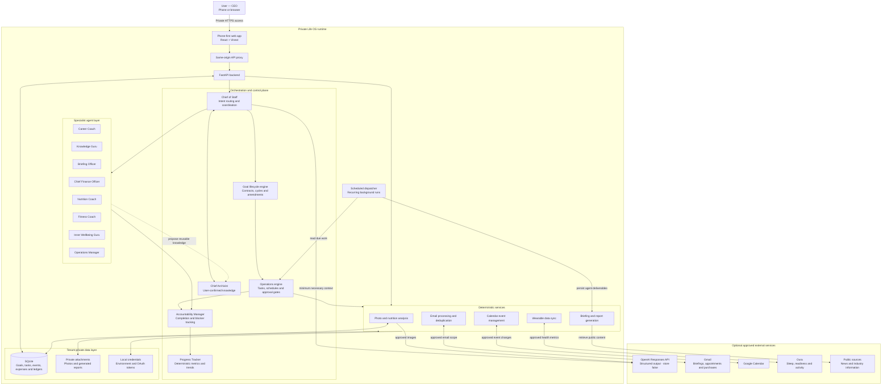
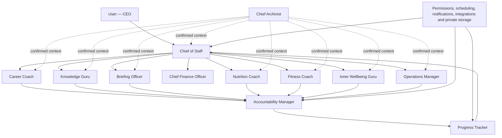

# Life OS

A privacy-first, multi-agent architecture for helping people plan their lives, follow through on commitments, learn, stay informed, care for their health and relationships, and understand their progress over time.

The system is organized like a small company. The user acts as CEO, a Chief of Staff coordinates specialist agents, and independent company-wide functions provide accountability, analytics, and institutional memory.

## Implementation

This repository now includes a working public backend scaffold:

- Twelve configurable agent roles with explicit privacy and action boundaries
- A deterministic router coordinated by the Chief of Staff
- User-selected life-area onboarding with an explicit Briefing Officer option
- Versioned, time-bounded Goal Contracts with exact metrics and routines
- Editable tracking protocols generated by the Operations Manager
- Materialized check-in schedules with duplicate-delivery protection
- Specialist-led end-of-cycle reviews and renewable goal history
- Contextual Archivist study debriefs with confirmed, searchable knowledge records
- OpenAI Responses API support with structured outputs and `store: false`
- An offline client for setup and tests without an API key
- Tenant-scoped SQLite storage for commitments, progress events, and confirmed memory
- Deterministic progress calculations
- A FastAPI interface
- A private-profile example and a git-ignored private configuration workflow
- Tests for routing, tenant isolation, memory confirmation, and analytics

### Quick start

```bash
python -m venv .venv
source .venv/bin/activate
pip install -e '.[dev]'
cp .env.example .env
python scripts/bootstrap_private.py
```

Set `OPENAI_API_KEY` in `.env` for live model responses. Without a key, Life OS
runs with a safe offline client so its API and deterministic services can still
be tested.

To use the private profile:

```bash
export LIFE_OS_PROFILE=private/profile.toml
life-os serve
```

Then open `http://127.0.0.1:8000/docs` for the interactive API documentation.

The main workflow is available through these endpoint groups:

- `/v1/onboarding/*` — choose which life areas to enable
- `/v1/planning-sessions/*` — hold persistent goal-setting conversations with specialists
- `/v1/goals/*` — draft, approve, amend, review, and renew Goal Contracts
- `/v1/goals/{id}/tracking-protocol/*` — inspect, edit, and approve check-in prompts
- `/v1/check-ins/*` — retrieve due prompts and record delivery or response status
- `/v1/knowledge-records/*` — confirm and search structured learning records
- `/v1/commitments` and `/v1/events` — record confirmed actions and measurements
- `/v1/progress` — calculate deterministic progress summaries

The included scheduler creates a reliable due queue. Delivering that queue as a
phone push, email, or message requires a notification connector; the scheduler
does not pretend that an external notification was sent.

### Private phone interface

The `mobile/` directory contains a phone-first web interface for the private Life
OS service. It provides three primary areas:

- **Plan** shows a selected day's plan and opens its task and check-in experiences.
- **Progress** displays confirmed commitments, active goals, and recorded totals.
- **Agents** opens a focused conversation with any member of the Life OS company.

The interface contains no personal goals, names, credentials, or private defaults.
It reads private information at runtime through a same-origin server proxy. By
default, that proxy connects only to `http://127.0.0.1:8000` on the same computer.

Start the private API as described above, then start the interface in another
terminal:

```bash
cd mobile
cp .env.example .env.local
pnpm install
pnpm dev --host 127.0.0.1
```

Open `http://127.0.0.1:3000` on the computer. For access from a phone, place this
loopback-only interface behind a private device network or authenticated reverse
proxy. Do not bind the API directly to a public interface. Once opened on a phone,
the web app can be added to the Home Screen.

### Public/private boundary

The public repository contains reusable code and generic examples. The complete
`private/` directory, `.env`, and local databases are ignored by Git. Run this
before publishing changes:

```bash
python scripts/check_public_tree.py
```

Never use `git add -f` on private files.

## Design principles

1. **Agents represent durable life domains.** Temporary goals—such as finding a job, earning a promotion, completing a project, or preparing for an event—belong inside a stable agent.
2. **The user remains the CEO.** Agents advise, organize, and prepare actions. The user retains final authority.
3. **Plans and outcomes are different.** A task is not complete until the user or an approved data source confirms it.
4. **Deterministic software controls sensitive actions.** Scheduling, permissions, notifications, calculations, and approval gates should not depend entirely on model judgment.
5. **Memory is explicit.** The system proposes information to remember and allows the user to confirm, edit, expire, or delete it.
6. **Privacy is a product feature.** Every user receives isolated storage, credentials, retrieval indexes, permissions, and audit records.
7. **Health-related agents support wellness, not medical diagnosis or treatment.**

## Technical architecture

Life OS separates model-based reasoning from deterministic application logic,
external integrations, and tenant-private storage. Specialist agents receive
only the context and permissions required for the operation they are performing.



The language model handles interpretation, conversation, and structured
proposals. Deterministic software owns calculations, scheduling, permissions,
deduplication, persistence, and approval gates. Durable personal data remains in
tenant-private storage, and external services receive the minimum context needed
for a specific operation.

## Organization chart



## Executive office

### User — CEO

The user defines the company's direction and retains final decision-making authority.

The CEO:

- Establishes priorities, goals, and acceptable tradeoffs
- Chooses which domains and integrations to enable
- Grants and revokes access to personal data
- Reviews consequential recommendations
- Approves external actions
- Changes strategy when circumstances change

### Chief of Staff

The Chief of Staff is the primary user-facing agent and coordinates the company.

Responsibilities:

- Turn high-level priorities into a realistic daily or weekly plan
- Route requests to the correct specialist
- Reconcile competing demands across life domains
- Protect focus time, recovery time, and important relationships
- Surface decisions that require CEO attention
- Combine specialist recommendations into one coherent response
- Present daily briefings, reviews, and upcoming commitments
- Prevent the plan from exceeding the user's available time and energy

The Chief of Staff does not replace specialists. It coordinates them and remains responsible for the final user-facing plan.

## Department roles

### Career Coach

The Career Coach manages the user's professional life across changing phases. Job search is one possible goal, not a permanent agent.

Possible goals include:

- Find a new role
- Onboard successfully
- Deliver a professional project
- Meet commitments made at work
- Develop a professional network
- Build a public professional brand
- Prepare for a promotion
- Change functions or industries
- Start a business or independent practice

Responsibilities:

- Convert professional goals into outcomes, milestones, and next actions
- Maintain project and commitment pipelines
- Track deadlines, stakeholders, dependencies, and blockers
- Prepare meeting agendas and capture approved follow-up actions
- Maintain an accomplishment and evidence log
- Support applications, interviews, promotion cases, and career decisions
- Manage professional-brand workflows such as articles, talks, networking, and portfolio updates
- Draft communications while requiring approval before sending

The Career Coach owns professional outcomes. When an outcome requires a new skill, it requests help from the Knowledge Guru.

### Knowledge Guru

The Knowledge Guru develops durable knowledge and capability.

Responsibilities:

- Convert learning goals into curricula and practice plans
- Organize books, courses, notes, exercises, and reference material
- Explain unfamiliar concepts at the user's preferred level
- Generate retrieval practice, flashcards, quizzes, and application exercises
- Track mastery separately from content consumption
- Identify knowledge gaps revealed by professional work
- Connect new concepts to existing knowledge
- Schedule spaced review and periodic skill assessments

The Knowledge Guru answers: **“What should I understand, remember, or become capable of doing?”**

### Briefing Officer

The Briefing Officer monitors recent external developments and produces concise, traceable briefings.

Responsibilities:

- Ingest approved publications, newsletters, feeds, saved articles, and public sources
- Summarize new information with source links and publication dates
- Deduplicate overlapping coverage
- Separate reported facts, analysis, opinion, and uncertainty
- Rank information according to user-defined interests and goals
- Maintain a reading queue
- Track which briefings were opened or marked useful
- Compare summaries against source material and record quality feedback
- Escalate durable learning opportunities to the Knowledge Guru
- Escalate actionable professional developments to the Career Coach

The Briefing Officer answers: **“What changed recently, and why might it matter?”**

### Nutrition Coach

The Nutrition Coach helps users plan meals and record food with minimal friction.

Responsibilities:

- Accept meal logs through text, voice, photographs, barcodes, recipes, or saved favorites
- Estimate portions, calories, and nutrients while preserving uncertainty
- Ask for confirmation when an estimate could materially affect the record
- Support user-defined meal schedules, preferences, budgets, and restrictions
- Suggest meal options and grocery lists
- Track user-selected nutrition goals and consistency
- Send confirmed nutrition events to the Progress Tracker

The Nutrition Coach must not diagnose conditions, prescribe treatment, or present estimated nutrition values as exact. Users with clinician-managed diets should be able to enter a professional-provided plan.

### Fitness Coach

The Fitness Coach supports physical activity, sleep, and recovery.

Responsibilities:

- Create activity plans based on user-defined goals and constraints
- Track workouts, movement, consistency, and recovery
- Accept manual logs and approved wearable or health-platform data
- Distinguish planned workouts from confirmed completion
- Track strength, endurance, mobility, sleep, and other enabled metrics
- Adjust ordinary plans based on adherence and user-reported recovery
- Detect scheduling conflicts and recommend realistic alternatives
- Send confirmed activity and recovery events to the Progress Tracker

The Fitness Coach must not diagnose injuries or encourage users to ignore serious symptoms. Medical decisions remain outside its scope.

### Inner Wellbeing Guru

The Inner Wellbeing Guru supports private reflection and intentional personal practices.

Responsibilities:

- Guide journaling and emotional processing
- Facilitate gratitude, accomplishment, and affirmation practices
- Support meditation and reflection routines
- Help users identify values, patterns, and intentional next actions
- Track practice completion without judging the content
- Let users decide whether any derived insight may be shared with another agent
- Keep raw journal content private by default

The Inner Wellbeing Guru is not a therapist, crisis service, or diagnostic system. The product should provide appropriate crisis and professional-help pathways when necessary.

### Operations Manager

The Operations Manager handles personal and household logistics so users can devote more attention to the people and experiences involved.

Responsibilities:

- Coordinate household schedules, recurring routines, and appointments
- Manage shared lists, purchases, maintenance, and administrative tasks
- Support relationship rituals and important occasions
- Plan travel and events
- Coordinate care routines for dependents and pets
- Organize private photographs and memory projects
- Draft messages, reservations, posts, or purchases for approval
- Track recurring obligations without treating relationships as productivity metrics

External communication, booking, purchasing, and publishing always pass through an approval gate.

## Company-wide functions

### Accountability Manager

The Accountability Manager works across every department and closes the gap between intention and action.

Responsibilities:

- Convert accepted plans into explicit commitments
- Validate that commitments have a clear outcome and reasonable deadline
- Schedule check-ins according to user preferences and quiet hours
- Request a status such as `done`, `partial`, `blocked`, `skipped`, or `rescheduled`
- Record user-provided evidence when appropriate
- Identify repeated avoidance, unrealistic scope, and recurring blockers
- Recommend smaller commitments or renegotiated deadlines
- Prevent activity from being mistaken for achievement
- Send confirmed outcomes to the Progress Tracker

The Accountability Manager may challenge a plan, but it cannot redefine the CEO's goals.

### Progress Tracker

The Progress Tracker converts confirmed events into understandable progress reporting.

Responsibilities:

- Produce daily, weekly, monthly, and quarterly reports
- Compare planned commitments with confirmed outcomes
- Track progress by domain, goal, project, and routine
- Identify trends, bottlenecks, and recurring blockers
- Distinguish behavior metrics from outcome metrics
- Preserve uncertainty and provenance
- Generate charts using deterministic calculations
- Let users choose whether to create a cross-domain summary

The model may explain a trend, but it must not calculate or invent the underlying
numbers. Metrics should be generated from stored events in ordinary application
code.

### Chief Finance Officer

The Chief Finance Officer helps users define measurable financial goals, build a
trustworthy view of spending, and review progress without moving money or making
purchases. Optional email-based expense capture processes only user-approved email
scope, stores minimum transaction facts, deduplicates by source and transaction,
and keeps different currencies separate unless the user approves a conversion
source.

Responsibilities:

- Turn user-defined financial outcomes into measurable, time-bounded plans
- Classify only clear purchases, refunds, charges, and cancellations
- Deduplicate email-derived transactions using a persistent processing ledger
- Store only the minimum transaction facts needed for reporting
- Keep currencies separate unless the user approves a conversion source
- Report spending, refunds, net totals, and category breakdowns

The Chief Finance Officer does not move money, make purchases, or provide
regulated financial advice.

### Chief Archivist

The Chief Archivist maintains the company's confirmed institutional memory.

Responsibilities:

- Store confirmed goals, preferences, constraints, relationships, and routines
- Extract proposed context from user-provided text, documents, or images
- Accept direct requests from the user and handoffs from every specialist
- Ask users to confirm durable memory before saving it
- Record the source, confidence, creation date, and optional expiration date
- Provide only relevant context to each agent
- Enforce domain-level privacy boundaries
- Support viewing, editing, exporting, expiring, and deleting memories
- Prevent one user's information from entering another user's memory or retrieval index

The Chief Archivist should store concise structured facts rather than indiscriminately retaining entire conversations.

The Archivist is a horizontal company service, not a department owned by the
Knowledge Guru. Learning sessions trigger a debrief by default. Any other
specialist may offer an Archivist handoff when work produces a reusable insight,
decision, preference, explanation, or artifact. Routine completion data remains
with Operations and the Progress Tracker. Every handoff follows
**propose → preview → confirm → save**, and the user may invoke the Archivist
directly at any time.

## Modus operandi: renewable commitment cycles

Life OS does not treat a vague aspiration as a trackable goal. Every enabled
specialist works with the user to negotiate a precise, time-bounded Goal Contract.
The user can discuss ideas with that specialist at any time, but nothing becomes
active until the user explicitly approves the contract.

### 1. Select life areas

During onboarding, the Chief of Staff asks which parts of life the user wants to
plan and track. A user may enable any combination and can change the selection
later.

Every default onboarding question is generic. It may offer broad examples but
must not mention, infer, or reveal a person's goals, relationships, location,
projects, health information, or prior conversation content. Personalization begins
only inside that user's private session after the user supplies or approves context.

| Onboarding option | Owning specialist | Primary question |
| --- | --- | --- |
| Career & Professional Growth | Career Coach | What professional outcome should change? |
| Learning & Skill Building | Knowledge Guru | What should the user understand or become capable of doing? |
| News & Industry Briefings | Briefing Officer | What changed recently, and why might it matter? |
| Money & Financial Goals | Chief Finance Officer | What financial outcome should we understand or achieve? |
| Food & Nutrition | Nutrition Coach | What exact user-approved nutrition plan or target should be followed? |
| Fitness & Recovery | Fitness Coach | What movement, sleep, or recovery result should be achieved? |
| Inner Wellbeing | Inner Wellbeing Guru | What intentional practice should be supported? |
| Life & Family Operations | Operations Manager | What recurring personal or household responsibility needs coordination? |

The Briefing Officer is deliberately separate from the Knowledge Guru. Briefings
provide recent, source-linked awareness. Learning builds durable knowledge and
capability.

### 2. Negotiate an exact Goal Contract

The specialist asks what the user wants, suggests a concrete plan, takes feedback,
and keeps revising the draft until both the target and the tracking method are
unambiguous. A Goal Contract records:

- The outcome, motivation, and definition of success
- The owning specialist and life area
- Exact metrics, units, target type, and measurement cadence
- Milestones, recurring actions, and minimum success definitions
- Start date, review date, and commitment duration
- Constraints and evidence expectations
- Draft, active, awaiting-review, paused, completed, or abandoned status

Goal-setting conversations are stored as tenant-scoped planning sessions so the
specialist can incorporate earlier answers and feedback. Finalizing a session
creates a draft contract—not an active goal. The user must still inspect and
approve that contract separately.

After one specialist finalizes a draft, control returns automatically to the
Chief of Staff. The Chief of Staff acknowledges the configured area, introduces
the next selected area that does not yet have a finalized draft, and opens that
specialist's planning session. This repeats until every selected area is
configured. An existing unfinished session is resumed instead of duplicated.
The user may pause onboarding or revisit any specialist at any time.

Nutrition goals, for example, must contain the exact user-approved meal plan or
calorie, macro, micronutrient, schedule, or range being tracked. The Nutrition
Coach does not invent clinical requirements and defers to clinician-provided plans.

### 3. Operationalize the approved goal

After approval, the Operations Manager converts the contract into an editable
tracking protocol. Each prompt specifies its question, cadence, response type,
linked metric, preferred time, and active state. Supported cadences are daily,
weekly, monthly, quarterly, yearly, and end of cycle.

The protocol remains proposed until the user approves it. Approval materializes
the scheduled check-ins. Replacing an approved protocol replaces only pending
future check-ins; already delivered history remains intact.

Milestones create one-time prompts containing the expected work and due date. A
study milestone can be assigned to the Chief Archivist, which begins the debrief
by naming the scheduled source and topic rather than asking a context-free question.
For non-learning milestones, `capture_knowledge: true` tells the owning specialist
to offer an Archivist handoff if the work produced reusable knowledge. It does not
archive the milestone automatically.

Milestones default to `kind: "user_commitment"`. Use
`kind: "agent_delivery"` for scheduled outputs such as a briefing or report. The
owning agent prepares the output and asks for usefulness feedback; it must not ask
the user whether the user completed the agent's work.

The same ownership rule applies to recurring routines. A routine is a
`user_commitment` when the person must act, report, decide, or participate—for
example eating a meal, exercising, studying, reflecting, or confirming a plan.
It is an `agent_delivery` when Life OS can produce the outcome without waiting for
the user—for example preparing a briefing, syncing confirmed appointments to a
calendar, or publishing an analytics report. Agent deliveries appear separately
from the user's task list and report actions taken plus any exceptions requiring
attention.

Goal metrics are measurement definitions, not tasks. Life OS calculates them from
confirmed progress events and approved sources; it does not create end-of-cycle
"What was your…" questions that ask the user to reconstruct data the system should
already know.

### Archivist study debriefs

For every assigned source, the Chief Archivist asks the user to summarize what
they learned and then probes definition, mechanism, trade-offs, application, and
possible misconceptions. Different books or sources receive separate debriefs and
separate records.

A proposed knowledge record contains the source, topic, expected scope, the user's
summary, probe questions and answers, strengths, gaps, tags, and a concise
interview-recall explanation. It is excluded from search until the user confirms
it. Confirmed records are tenant-isolated and searchable by topic or source so a
user can refresh their own understanding before a later interview or assessment.

### 4. Plan, track, and verify

The Chief of Staff uses approved Goal Contracts to propose a coherent daily plan.
The owning specialist conducts domain conversations. The Chief Accountability
Officer follows up on accepted commitments. Only user-confirmed or approved-source
events count as outcomes. The Progress Tracker calculates the numbers in ordinary
application code rather than asking a model to invent them.

For email-backed briefings, an approved Gmail label is the access boundary. The
Briefing Officer selects labeled messages by their message timestamp and a durable
processed-message ledger—not by whether Gmail currently marks them read or unread.
When the user explicitly enables it, successfully processed labeled messages may
be marked read only after the briefing and coverage ledger are saved. This does
not authorize archiving, deletion, relabeling, or access to unlabeled mail.

### 5. Conduct the end-of-cycle review

The user chooses the commitment duration during goal setting. At the review date,
the scheduler places a follow-up in the owning specialist's due queue. The review
packet combines deterministic statistics from the Progress Tracker with questions
such as how the cycle felt, what worked, what was difficult, and whether the goal
remains meaningful.

The specialist may recommend continuing, increasing or reducing the target,
changing the plan, replacing the goal, pausing it, or completing it. The user makes
the decision. Life OS never renews or changes a goal automatically.

### 6. Renew without erasing history

If the user continues, Life OS creates a new draft cycle linked to the previous
cycle. The next cycle receives its own dates, targets, prompts, and approval. If a
goal changes before the review date, Life OS stores a dated amendment and increments
the contract version rather than rewriting the past.

```text
Select life areas
        ↓
Specialist negotiates an exact draft goal
        ↓
Chief of Staff introduces the next selected specialist; repeat until configured
        ↓
User approves a time-bounded Goal Contract
        ↓
Operations Manager proposes tracking prompts
        ↓
User approves the tracking protocol
        ↓
Chief of Staff plans; specialists and accountability collect confirmations
        ↓
The Progress Tracker prepares end-of-cycle statistics
        ↓
Owning specialist initiates reflection and recommends a next step
        ↓
User completes, pauses, replaces, or approves a new commitment cycle
```

The Chief Archivist supplies only relevant, confirmed context throughout this
loop and preserves the user's domain-level privacy choices.

## Standard Goal Contract

```json
{
  "tenant_id": "user_123",
  "domain": "learning",
  "owner_agent": "knowledge_guru",
  "title": "Demonstrate practical proficiency in a chosen topic",
  "motivation": "Apply the skill in a real project",
  "success_definition": "Complete the assessment and ship the agreed project",
  "start_at": "2030-01-01T09:00:00Z",
  "review_at": "2030-03-01T09:00:00Z",
  "metrics": [
    {
      "key": "practice_sessions",
      "label": "Practice sessions",
      "unit": "session",
      "target_type": "at_least",
      "target_value": 3,
      "cadence": "weekly"
    }
  ],
  "milestones": [
    {
      "title": "Complete and review one applied exercise",
      "success_criteria": "A reusable decision note exists",
      "due_at": "2030-01-08T20:00:00Z",
      "kind": "user_commitment",
      "capture_knowledge": true
    }
  ],
  "routines": [
    {
      "title": "Complete a focused practice session",
      "cadence": "weekly",
      "target_count": 3,
      "unit": "session",
      "minimum_success": "One exercise is completed and reviewed"
    }
  ]
}
```

## Standard commitment record

All departments should create commitments using the same contract:

```json
{
  "user_id": "user_123",
  "domain": "professional",
  "goal_id": "goal_456",
  "commitment": "Complete the first draft of the project proposal",
  "minimum_success": "A reviewable draft exists",
  "due_at": "2030-01-15T17:00:00Z",
  "evidence_policy": "user_confirmation",
  "reminder_policy": "one_day_then_two_hours",
  "status": "planned"
}
```

## Standard progress event

Agents submit confirmed observations through a shared event format:

```json
{
  "user_id": "user_123",
  "domain": "fitness",
  "goal_id": "goal_789",
  "metric": "workout_completed",
  "value": 1,
  "unit": "session",
  "source": "user_confirmed",
  "confidence": 1.0,
  "occurred_at": "2030-01-14T18:30:00Z"
}
```

Every event should include provenance. Estimated, inferred, imported, and user-confirmed values must remain distinguishable.

## Supporting services that are not agents

These components should be implemented as predictable software services:

### Identity and tenant isolation

- Separate every user's records with a tenant identifier
- Enforce isolation at the database level
- Use separate authorization grants for each user and provider
- Prevent shared personal-memory indexes

### Permission manager

- Request the narrowest useful access
- Support per-domain and per-source consent
- Let users pause synchronization without deleting their account
- Make revocation easy and visible

### Scheduler

- Support time zones, quiet hours, recurrence, retries, and idempotency
- Prevent duplicate reminders and notification storms
- Continue operating reliably without model involvement

### Notification service

- Deliver approved push, email, or messaging notifications
- Deep-link to actions such as done, partial, blocked, or reschedule
- Respect per-channel preferences and frequency limits

### Approval gateway

Require explicit approval before:

- Sending a message or email
- Publishing content
- Submitting an application or form
- Making a purchase or reservation
- Modifying an external calendar
- Sharing private information with another person or service

### Connector layer

Integrations may include:

- Email and calendar providers
- Health and wearable platforms
- Task and project-management systems
- Newsletters, feeds, and saved-reading services
- Cloud file storage
- Professional and publishing platforms

Each connector should expose a narrow, auditable interface rather than unrestricted account access.

### Google Calendar connector

Life OS includes an optional Google Calendar connector for private deployments.
It requests the narrow `calendar.events` OAuth scope and supports verified event
listing, idempotent creation, updates, cancellations, and attendee invitations.
Credentials and tokens must remain outside version control.

Install the optional dependency and authorize a desktop OAuth client:

```bash
pip install -e '.[google-calendar]'
life-os calendar-connect \
  --credentials /private/path/google-calendar-credentials.json \
  --token /private/path/google-calendar-token.json
```

The first run opens Google's OAuth approval flow. For multi-user deployments,
store a separate encrypted token per tenant and never place tokens, client secrets,
email addresses, or event content in the public repository.

### Private data stores

Use separate stores or access policies for:

- Operational tasks and commitments
- Progress events
- Long-term confirmed memory
- Health and wellbeing records
- Documents and images
- OAuth credentials and other secrets
- Audit records

## Privacy and safety requirements

An implementation intended for multiple users should include:

- Encryption in transit and at rest
- Database-enforced tenant isolation
- Per-user OAuth credentials
- Secrets stored outside application logs and model prompts
- No raw personal content in analytics or tracing systems
- Separate access controls for health, journal, family, and professional data
- User-controlled data export and deletion
- Configurable retention and automatic expiration
- An audit view showing what every agent accessed and attempted
- Explicit approval for external side effects
- Tests that attempt cross-user data access
- Clear health, wellbeing, and financial scope limitations

## Configurability

Users should be able to:

- Enable only the departments they want
- Rename roles without changing their capabilities
- Choose communication tone and reminder style
- Set quiet hours and escalation limits
- Define which agents may share derived information
- Choose which sources count as evidence
- Set domain-specific retention rules
- Replace or extend departments through a stable agent interface

The role names provide personality. The underlying interfaces should remain functional and stable so communities can create alternative personas without forking the architecture.

## Summary

The Personal Operating Company has:

- One CEO: the user
- One coordinating executive: the Chief of Staff
- Seven domain specialists
- Three independent company-wide functions
- Deterministic infrastructure for permissions, schedules, notifications, calculations, approvals, integrations, and storage

This structure remains stable as a user's goals change. New goals become initiatives within the appropriate department instead of creating a new agent for every phase of life.
